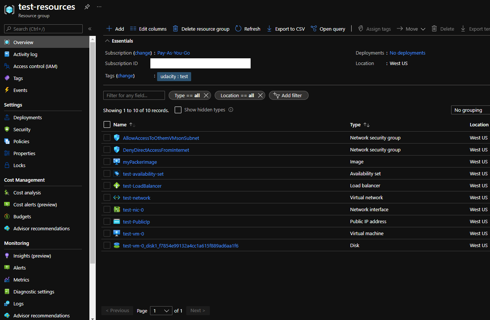

# Azure Infrastructure Operations Project: Deploying a scalable IaaS web server in Azure

### Introduction
For this project, you will write a Packer template and a Terraform template to deploy a customizable, scalable web server in Azure.

### Getting Started
1. Clone this repository

2. Create your infrastructure as code

3. Update this README to reflect how someone would use your code.

### Dependencies
1. Create an [Azure Account](https://portal.azure.com) 
2. Install the [Azure command line interface](https://docs.microsoft.com/en-us/cli/azure/install-azure-cli?view=azure-cli-latest)
3. Install [Packer](https://www.packer.io/downloads)
4. Install [Terraform](https://www.terraform.io/downloads.html)

### Instructions
after successfully fullfilling the dependecy seciton, to deploy scalable IaaS web server, we need to do the following:
1. create image with help of packer and deploy it on azure
2. with the help of terraform deploy VMs and are required resources e.g. VM

In the following, the detail will be discussed.

### Credentials
Before start doing it, we need to setup a couple of enviroment variables to avoid saving them in our code and eventually repository.
They are azure related credentials.

Please do not change their name. Assign to each name its respective value.
1. ARM_CLIENT_ID  <--> client_id
2. ARM_CLIENT_SECRET <--> client_secret
3. ARM_SUBSCRIPTION_ID <--> subscription_id
4. ARM_TENANT_ID <--> tenant_id

Packer and Terraform find these variable automatically and use them for authentication.

### Packer: Image template and image deployment
Since packer needs resource group, we need to create resource group (RG) first. It is either via portal or Azure CLI like.
#### Azure CLI
```shell
az group create -l westus -n MyResourceGroup
```
HINT: use "az login" to login into azure before executing the command to create RG.

After creating the resource group, we could use `server.json` file to generate our image and store it under the created RG.

HINT: please do not forget to setup your credentials as it is described in credentials section.

To create and deploy, use the following command:
HINT: these commands should executed in the same folder as server.json.
```sh
packer  build .\server.json
```
To check whether it was successful or not, use the following command:
```sh
az image list
```
Also you want to delete image (just in case):
```sh
az image delete -g RGName -n myPackerImageName
```

### Terrafrom: Deploying our VMs and resources
To be able deploy the needed resources such as VMs via terraform, there files are required:
1. main.tf: Contains VMs necessary resources such NIC (Netwokr Interface Card) and configuration for each part.
2. variable.tf: Contains user input dynamic variable e.g. number of VMs and theirs default value.
3. terraform.tfvar: To avoid user to be prompted for the variables without default, tfvars could be used.
                    This file contains user input such as dynamic number of VMs, which could vary from time to time.

To be created resources:
* Virtual network subnet on virtual network
* Network security group
    * Allow Explicitly access t other VMS
    * Deny direct access from the internet
* Network interface
* Public IP
* Load balancer with backend address pool
* Virtual machine avaiability set
* Virtual machine with packer image
* Disk

HINT: The Following command should be executed in the same folder as the listed files above.
To deploy the necessary resources, use the followin command:
```sh
terraform init
```
```sh
terraform plan -out FileName
```
```sh
terraform apply FileName
```

If you want to destory the generated resources and configuartion:
```sh
terraform destroy
```

### Output
After packer and terraform are finished subsequently. Your RG should look like this:

NOTE: Number of VMs in this example is one.




